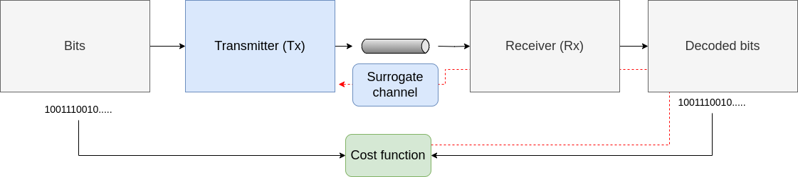

# Differentiable Surrogate Channel
This repository contains the work to implement and validate the *differentiable surrogate channel* [1] as a gradient estimator for transmitter optimization problems in a digital communication system.

## Introduction

The basic blockdiagram for the DSC optimization can be seen below

## Getting started
The repository was created with Python 3.10.12 and the package requirements are listed in the `requirements.txt` file.
To get started create a new virtual environment (either in conda or with python venv) and run

``
pip install -r requirements.txt
``

This should enable you to run the starting example

``
python main_awgn_example.py
``

## References and resources

[1] Z. Niu, H. Yang, H. Zhao, C. Dai, W. Hu, and L. Yi, “End-to-End Deep Learning for Long-haul Fiber Transmission Using Differentiable Surrogate Channel,” *Journal of Lightwave Technology*, vol. 40, no. 9, pp. 2807–2822, May 2022, doi: 10.1109/JLT.2022.3148270.
